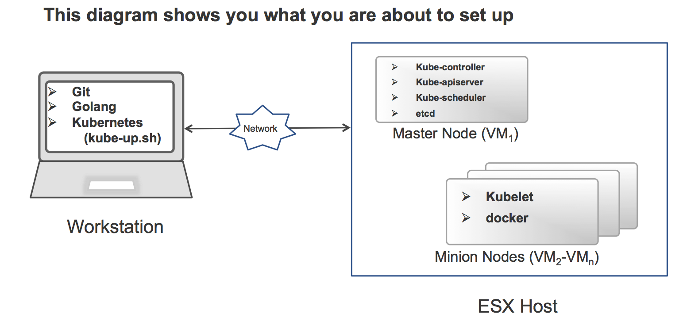

<!-- BEGIN MUNGE: UNVERSIONED_WARNING -->

<!-- BEGIN STRIP_FOR_RELEASE -->


<h2>PLEASE NOTE: This document applies to the HEAD of the source tree</h2>

If you are using a released version of Kubernetes, you should
refer to the docs that go with that version.

<strong>
The latest 1.0.x release of this document can be found
[here](http://releases.k8s.io/release-1.0/docs/getting-started-guides/vsphere.md).

Documentation for other releases can be found at
[releases.k8s.io](http://releases.k8s.io).
</strong>
--

<!-- END STRIP_FOR_RELEASE -->

<!-- END MUNGE: UNVERSIONED_WARNING -->
Getting started with vSphere
-------------------------------

The example below creates a Kubernetes cluster with 4 worker node Virtual
Machines and a master Virtual Machine (i.e. 5 VMs in your cluster) on a vSphere host. This
cluster is set up and controlled from your workstation (or wherever you find
convenient).

Here's a diagram of what the final result will look like:


**Table of Contents**

- [Prerequisites](#prerequisites)
- [Setup](#setup)
- [Starting a cluster](#starting-a-cluster)
- [Extra: debugging deployment failure](#extra-debugging-deployment-failure)

### Prerequisites

- You need administrator credentials to an ESXi machine or vCenter instance.
- Prerequisites on your workstation
  1. You must have Go (version 1.2 or later) installed: [www.golang.org](http://www.golang.org). When installed, files are placed under $HOME/src/go.
  2. You must have your `GOPATH` set up and include `$GOPATH/bin` in your `PATH`.

     ```sh
     export GOPATH=$HOME/src/go
     mkdir -p $GOPATH
     export PATH=$PATH:$GOPATH/bin
     ```

  3. Install the govc tool to interact with ESXi/vCenter:

     ```sh
     go get github.com/vmware/govmomi/govc
     ```

  4. Get or build kubernetes [binary release](binary_release.md).


### Setup

Follow these steps on your workstation :

1. Download a prebuilt Debian 7.7 VMDK. This image will be used as base image for Kube cluster VMs:
  
   ```sh
   curl --remote-name-all https://storage.googleapis.com/govmomi/vmdk/2014-11-11/kube.vmdk.gz{,.md5}
   md5sum -c kube.vmdk.gz.md5
   gzip -d kube.vmdk.gz
   ```

2. Import this VMDK into your vSphere datastore of the esx host:

   ```sh
   export GOVC_URL='user:pass@esxhostname'
   export GOVC_INSECURE=1 # If the host above uses a self-signed cert
   export GOVC_DATASTORE='target datastore'
   export GOVC_RESOURCE_POOL='resource pool or cluster with access to datastore'
   export GOVC_NETWORK='VM network'

   govc import.vmdk kube.vmdk ./kube/
   ```

3. Verify that the VMDK was correctly uploaded and expanded to ~3GiB:

   ```sh
   govc datastore.ls ./kube/ 
   ```

4. Take a look at the file `cluster/vsphere/config-common.sh` under kubernetes directory, fill in the required
parameters. The guest login for the image that you imported is `kube:kube`.

### Starting a cluster

Now, let's continue with deploying Kubernetes from your workstation.
This process takes about ~10 minutes.

```sh
cd kubernetes # Extracted binary release OR repository root
export KUBERNETES_PROVIDER=vsphere
cluster/kube-up.sh
```

Refer to the top level README and the getting started guide for Google Compute
Engine. Once you have successfully reached this point, your vSphere Kubernetes
deployment works just as any other one!

**Enjoy!**

### Extra: debugging deployment failure

The output of `kube-up.sh` displays the IP addresses of the VMs it deploys. You
can log into any VM as the `kube` user to poke around and figure out what is
going on (find yourself authorized with your SSH key, or use the password
`kube` otherwise).


<!-- BEGIN MUNGE: GENERATED_ANALYTICS -->
[]()
<!-- END MUNGE: GENERATED_ANALYTICS -->
